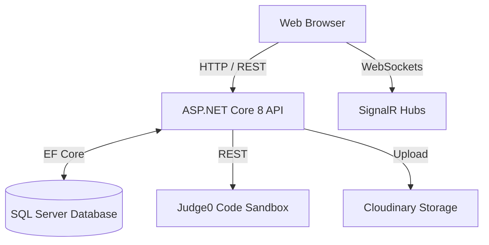

# DevLearningHub 🚀

<div align="center">
  
  <p><b>Nền tảng học tập, thi trắc nghiệm và giải bài tập lập trình toàn diện</b></p>
  
  [](https://dotnet.microsoft.com/)
  [](https://angular.io/)
  [](https://www.microsoft.com/sql-server)
  [](LICENSE)
</div>

---

## 📖 Bảng Mục Lục
1. [Giới thiệu Dự án](#-giới-thiệu-dự-án)
2. [Kiến trúc & Công nghệ](#-kiến-trúc--công-nghệ)
3. [Các Tính năng Cốt lõi](#-các-tính-năng-cốt-lõi)
4. [Mô hình Phân quyền (RBAC)](#-mô-hình-phân-quyền-rbac)
5. [Cấu trúc Thư mục](#-cấu-trúc-thư-mục)
6. [Hướng dẫn Cài đặt Local](#-hướng-dẫn-cài-đặt-local)
7. [Kiểm thử (Testing)](#-kiểm-thử-testing)
8. [Tài liệu Tham khảo](#-tài-liệu-tham-khảo)

---

## 🌟 Giới thiệu Dự án

**DevLearningHub** là một hệ sinh thái học tập dành riêng cho lập trình viên (Developers). Dự án không chỉ dừng lại ở việc cung cấp các khóa học hay bài tập tĩnh, mà mang đến một môi trường tương tác thực tế với các công cụ chấm code tự động, diễn đàn thảo luận thời gian thực, và lộ trình phát triển bản thân (Roadmap) thông qua cơ chế Gamification.

Hệ thống được thiết kế theo hướng **Enterprise**, phân tách rõ ràng giữa phân hệ Backend API độc lập và các ứng dụng Frontend cho từng nhóm đối tượng (Admin / End-User).

---

## 🏗 Kiến trúc & Công nghệ

### 1. Backend (`DevLearningHub.Api`)
Đóng vai trò là "bộ não" của hệ thống, xử lý toàn bộ logic nghiệp vụ, bảo mật và tương tác cơ sở dữ liệu.
* **Framework**: ASP.NET Core 8 Web API
* **Database & ORM**: SQL Server, Entity Framework Core 8
* **Authentication**: JWT (JSON Web Tokens) với cơ chế Access Token & Refresh Token
* **Real-time WebSockets**: SignalR (đồng bộ thông báo và bình luận ngay lập tức)
* **Cloud Storage**: Cloudinary (xử lý hình ảnh, avatar)
* **Code Execution Engine**: Judge0 API (Biên dịch và chạy code trong môi trường Sandbox cô lập)

### 2. Frontend (`DevLearningHub.Web.Admin` & `DevLearningHub.Web.User`)
Hai ứng dụng độc lập dành cho Quản trị viên và Người dùng cuối.
* **Framework chính**: Angular v20.3.0
* **State Management**: NgRx / RxJS (theo chuẩn Angular)
* **API Communication**: Angular HttpClient tích hợp Interceptors (xử lý gắn JWT và auto-refresh token)
* **Proxy Configuration**: Cấu hình `proxy.conf.json` để forward request `/api` xuống .NET Backend nhằm tránh lỗi CORS trong môi trường phát triển.

### Sơ đồ luồng hoạt động (Architecture Flow)


---

## 🚀 Các Tính năng Cốt lõi

### 🧑‍💻 Code Playground & Problem Bank (Ngân hàng Bài tập)
* **Đa ngôn ngữ**: Hỗ trợ viết code bằng nhiều ngôn ngữ phổ biến (C++, Java, Python, C#).
* **Chấm tự động (Auto-Judge)**: Mã nguồn của người dùng được gửi lên Judge0, biên dịch và chạy đối chiếu với các `Test Cases` bí mật, trả về kết quả (Pass/Fail, Time Limit, Memory Limit).
* **Bảng xếp hạng**: Cạnh tranh điểm số với các lập trình viên khác thông qua `SubmissionTestResult`.

### 📚 Hệ thống Bài Thi & Lộ trình (Quiz & Roadmaps)
* **Quiz Engine**: Hỗ trợ tạo đề thi (`QuizSets`), chọn lọc câu hỏi theo chủ đề (`Topics`). Có hệ thống tính giờ và thu thập đáp án (`QuizSessions`).
* **Lộ trình học tập**: Người dùng đăng ký vào các `Roadmaps`, theo dõi tiến độ hoàn thành các chủ đề (`UserTopicProgress`).
* **Gamification**: Tích lũy điểm kinh nghiệm (XP) thông qua `XpTransaction` để thăng hạng.

### 💬 Diễn đàn Tương tác (Forum)
* **Bài viết & Tag**: Đăng bài, đính kèm thẻ tags.
* **Bình luận đa tầng (Nested Comments)**: Trả lời bình luận, đệ quy nhiều cấp.
* **Real-time Synchronization**: Sử dụng SignalR để đẩy comment mới nhất đến tất cả những người đang xem bài viết mà không cần tải lại trang.
* **Voting**: Hệ thống Upvote / Downvote.

### 🛡 Quản trị & Kiểm duyệt (Moderation Queue)
* Admin / Moderator có màn hình quản lý các báo cáo vi phạm (Reports).
* Tính năng Soft-delete (Ẩn bài) bảo vệ dữ liệu.
* Ghi lại toàn bộ hành vi nhạy cảm thông qua `AuditLog` và `ModerationLog`.

---

## 🔐 Mô hình Phân quyền (RBAC)

DevLearningHub không sử dụng mô hình Role-based tĩnh lỏng lẻo. Thay vào đó, hệ thống ứng dụng mô hình **Permission-based kết hợp Override**.

### Công thức tính quyền hiệu lực:
```text
Effective Permissions = (Quyền kế thừa từ Role) + (Quyền Grant riêng) - (Quyền Deny riêng)
```

**Tại sao lại dùng mô hình này?**
Thay vì phải tạo ra hàng chục Role mới (ví dụ: `ForumModerator_NoDelete`, `QuizAdmin_OnlyView`), Quản trị viên chỉ cần cấp Role `Moderator` và trực tiếp **chặn (Deny)** quyền xóa bài của user đó.

**Bảo mật 2 lớp:**
1. **Backend**: Mỗi endpoint được bảo vệ cứng bằng Attribute `[HasPermission("action:resource")]`.
2. **Frontend**: Dựa vào danh sách Permission được nhúng trong chuỗi JWT để tự động **ẩn/hiện các nút bấm (UI Elements)** và điều hướng Sidebar.

---

## 📁 Cấu trúc Thư mục Hệ thống

```text
📦 DevLearningHub
 ┣ 📂 Database                  # Chứa các Script SQL tạo bảng và Seed dữ liệu mẫu
 ┣ 📂 DevLearningHub.Api        # Toàn bộ source code .NET 8 Web API
 ┃ ┣ 📂 Controllers             # REST API Endpoints
 ┃ ┣ 📂 Entities                # EF Core Models
 ┃ ┣ 📂 Hubs                    # SignalR WebSockets
 ┃ ┣ 📂 Services                # Business Logic (Auth, Judge0, Cloudinary)
 ┃ ┗ 📜 Program.cs              # DI Configuration & App Bootstrap
 ┣ 📂 DevLearningHub.Test       # Unit/Integration Tests (xUnit) cho API
 ┣ 📂 DevLearningHub.Web.Admin  # Angular 20 - Giao diện Quản trị
 ┣ 📂 DevLearningHub.Web.User   # Angular 20 - Giao diện Người dùng
 ┣ 📂 DevLearningHub.Web.Test   # E2E Tests (Playwright)
 ┣ 📜 THAY_DOI_API.md           # Nhật ký thay đổi API
 ┣ 📜 PHAN_QUYEN_*.md           # Tài liệu thiết kế đặc tả RBAC
 ┗ 📜 README.md                 # Tài liệu tổng quan (Bạn đang đọc nó!)
```

---

## 🛠 Hướng dẫn Cài đặt Local

Để chạy dự án này trên máy cá nhân, bạn cần cài đặt:
- [.NET 8 SDK](https://dotnet.microsoft.com/download/dotnet/8.0)
- [Node.js (v18.x trở lên)](https://nodejs.org/) & npm
- [SQL Server](https://www.microsoft.com/sql-server/)
- [Angular CLI](https://angular.io/cli) (`npm install -g @angular/cli`)

### Bước 1: Khởi tạo Cơ sở dữ liệu
1. Mở SQL Server Management Studio (SSMS).
2. Chạy các file script `.sql` trong thư mục `Database/` để tạo cấu trúc bảng và nạp dữ liệu mẫu (Seed Data).
3. Đảm bảo connection string trong `appsettings.json` của Backend trỏ đúng tới Database của bạn.

### Bước 2: Chạy Backend API
```bash
cd DevLearningHub.Api
dotnet restore
dotnet run
```
API sẽ khởi chạy (thường ở cổng `https://localhost:7081` hoặc `http://localhost:5031`).

### Bước 3: Chạy Frontend User
```bash
cd DevLearningHub.Web.User
npm install
ng serve
```
Truy cập `http://localhost:4200` để xem giao diện User. Mọi request `/api` sẽ tự động proxy sang backend.

### Bước 4: Chạy Frontend Admin
```bash
cd DevLearningHub.Web.Admin
npm install
ng serve --port 4201
```
Truy cập `http://localhost:4201` để vào trang quản trị.

---

## 🧪 Kiểm thử (Testing)

Dự án chú trọng rất cao vào chất lượng phần mềm với hàng trăm test case.

**1. Chạy Backend Tests (xUnit)**
```bash
cd DevLearningHub.Test
dotnet test
```
*Ghi chú: Đảm bảo SQL Server đang chạy vì Integration Test sử dụng TestDatabase để kiểm chứng luồng dữ liệu.*

**2. Chạy E2E Tests (Playwright)**
```bash
cd DevLearningHub.Web.Test
npm install
npx playwright test
```
Lệnh này sẽ mô phỏng trình duyệt thực để tương tác với UI và xác minh trải nghiệm người dùng hoàn chỉnh.

---

## 📖 Tài liệu Tham khảo

Nếu bạn là thành viên mới của team, vui lòng đọc các tài liệu đặc tả nghiệp vụ sau trước khi bắt đầu code:
- [`THAY_DOI_API.md`](THAY_DOI_API.md): Quy ước thiết kế REST API và các sửa đổi gần nhất.
- [`PHAN_QUYEN_BACKEND.md`](PHAN_QUYEN_BACKEND.md): Cơ chế nhúng Permission vào JWT.
- [`KE_HOACH_RBAC_WEB_ADMIN_WEB_USER.md`](KE_HOACH_RBAC_WEB_ADMIN_WEB_USER.md): Quy chuẩn render Sidebar dựa trên Quyền hiệu lực.
